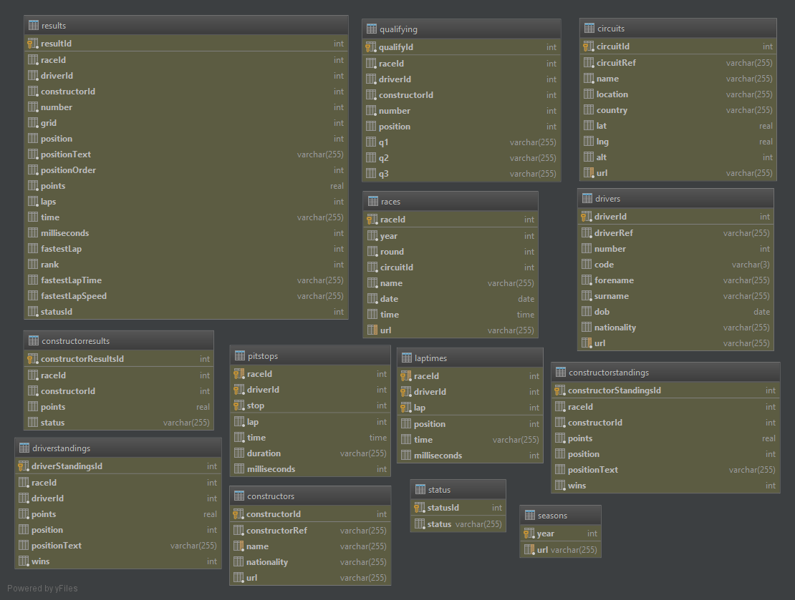

.. readme for data sources directory

Data Processing
---------------

Data Parsing
^^^^^^^^^^^^

F1 data isn't quite as available as something like college football data, and at best I have only been able to find
down to the lap. I have not found any source that will just let you directly download CSV files,
and the most open one being ergast's api for non-commercial use. The majority of the data used for modeling will
likely have to come from web-scraping and/or parsing PDFs.

The data parsing tools exist in the :py:mod:`formulapy.data` module and any local files will go into the data
folder that is outside the scope of the actual :py:mod:`formulapy` module. Local files, like fia pdf files,
are ignored through the .gitignore file, so aren't and cannot be included in the repository.

Data Sources
^^^^^^^^^^^^

When utilizing web-based data sources, you must be considerate and abide by their requests. This means that much of
the data available cannot be directly rehosted. Here is a list of sources that could be used for gathering data to
use in building models.

* FIA
    * `Japanese Grand Prix Example <http://www.fia.com/championship/reports/fia-formula-1-world-championship/2014/2014-japanese-grand-prix-race>`_

.. automodule:: formulapy.data.fia.parsers
    :members:
    :undoc-members:

* statsF1.com
    * `Russian Grand Prix Example <http://www.statsf1.com/en/2014/russie/classement.aspx>`_
* f1-facts.com
    * `Driver Stats Example <http://f1-facts.com/stats/drivers>`_
    * `Track Sections Example <http://f1-facts.com/track/703/2014>`_
* chicanef1.com
    * `Driver Example - Lewis <http://www.chicanef1.com/indiv.pl?name=Lewis%20Hamilton&type=D>`_
* f1-stats.info
    * `Driver Example - Fernando <http://www.f1-stats.info/profiles/drivers/fernando_alonso.html>`_
* vivaf1.com
    * `Driver Performance <http://www.vivaf1.com/performance.php>`_
* f1-fansite.com
    * `Mercedes Performance <http://www.f1-fansite.com/f1-teams/mercedes/>`_
* ergast.com api
    * `Race Results <http://ergast.com/api/f1/current/last/results>`_

It appears that the best starting point for historical data will be Ergast's free for non-commercial use API and
database download. This can be used in concert with any data that is updated during the race weekend. The Ergast
database can be downloaded as a MySQL database dump from their `Database Images Page <http://ergast.com/mrd/db>`_.
Since this is a MySQL file, instead of a sqllite file, you actually have to install MySQL to do this. The easiest way
is to install `XAMPP <https://www.apachefriends.org/index.html>`_, especially if you are on Windows or OSX. The
database schema looks like the following:

* f1-data.com
    * `homepage, not great <http://www.f1-data.com/script/top/index.php>`_
* f1fanatic.co.uk
    * `2013 Summary <http://www.f1fanatic.co.uk/statistics/2013-f1-statistics/race-data/>`_