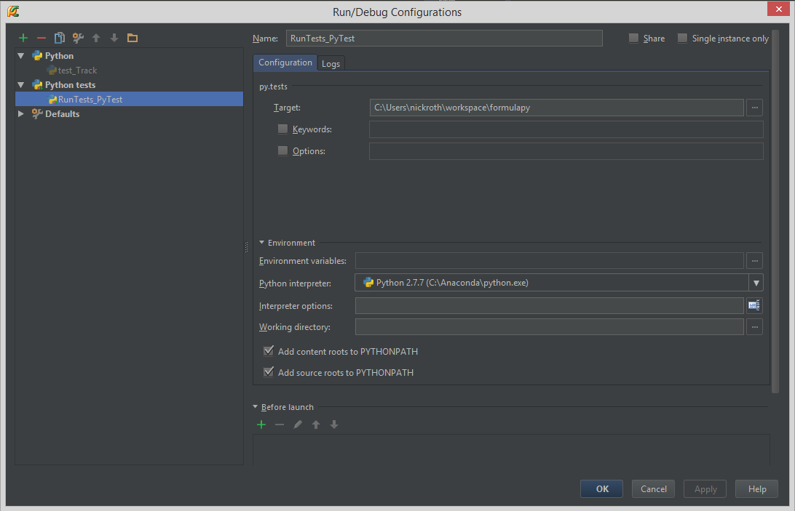

.. Pytest readme

Pytest
------

Pytest can run python unittests and nose tests, and provide a way to quickly create tests from functions. All of the 
tests will be placed in this tests folder and are automatically found by pytest based on having the keyword "test" in
the name of the python file and function. They can be separated out into different files as needed for organization. 

